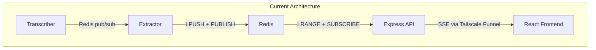
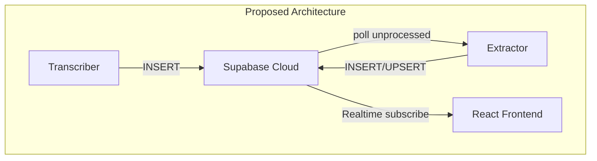
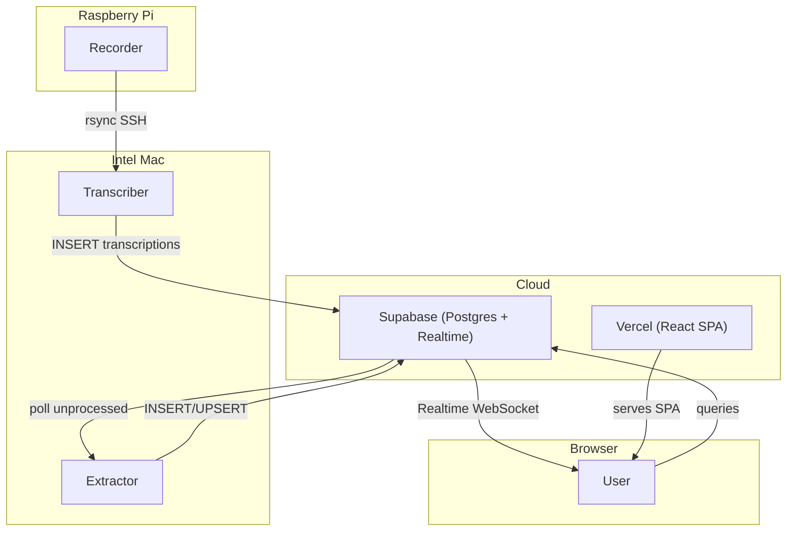

# Supabase Architecture Refactor

Replace Redis with Supabase PostgreSQL for persistent relational storage (transcriptions, vessels, communications, vessel positions) and use Supabase Realtime to maintain event-driven communication -- eliminating the Express API, Redis, and Tailscale Funnel from the architecture.

## Current vs Proposed Architecture





**Key wins:**

- Persistent relational storage (full history, not capped at 100)
- Normalized data model: vessels tracked as entities over time
- Eliminates 3 services/infra: Redis, Express API, Tailscale Funnel
- Frontend connects to Supabase directly (no proxy needed)
- Mac no longer needs to expose any ports

---

## Schema Design (4 tables)

### `transcriptions` -- raw Whisper output

```sql
CREATE TABLE transcriptions (
  id UUID PRIMARY KEY DEFAULT gen_random_uuid(),
  timestamp TIMESTAMPTZ NOT NULL,
  file TEXT NOT NULL,
  text TEXT NOT NULL,
  processed BOOLEAN DEFAULT FALSE,
  created_at TIMESTAMPTZ DEFAULT now()
);
CREATE INDEX idx_transcriptions_unprocessed
  ON transcriptions (created_at) WHERE processed = FALSE;
```

### `vessels` -- unique vessel entities, accumulated over time

```sql
CREATE TABLE vessels (
  id UUID PRIMARY KEY DEFAULT gen_random_uuid(),
  name TEXT,
  callsign TEXT UNIQUE,
  last_lat DOUBLE PRECISION,
  last_lon DOUBLE PRECISION,
  last_course DOUBLE PRECISION,
  last_seen_at TIMESTAMPTZ,
  created_at TIMESTAMPTZ DEFAULT now(),
  updated_at TIMESTAMPTZ DEFAULT now()
);
```

### `communications` -- structured extractions with FKs

```sql
CREATE TABLE communications (
  id UUID PRIMARY KEY DEFAULT gen_random_uuid(),
  transcription_id UUID REFERENCES transcriptions(id),
  vessel_id UUID REFERENCES vessels(id),
  timestamp TIMESTAMPTZ NOT NULL,
  text TEXT NOT NULL,
  channel TEXT,
  lat DOUBLE PRECISION,
  lon DOUBLE PRECISION,
  course DOUBLE PRECISION,
  message_type TEXT NOT NULL DEFAULT 'routine'
    CHECK (message_type IN ('routine', 'safety', 'distress', 'traffic')),
  summary TEXT NOT NULL,
  created_at TIMESTAMPTZ DEFAULT now()
);
CREATE INDEX idx_communications_timestamp ON communications (timestamp DESC);
CREATE INDEX idx_communications_vessel ON communications (vessel_id);
```

### `vessel_positions` -- position history for track lines

```sql
CREATE TABLE vessel_positions (
  id UUID PRIMARY KEY DEFAULT gen_random_uuid(),
  vessel_id UUID NOT NULL REFERENCES vessels(id),
  communication_id UUID REFERENCES communications(id),
  lat DOUBLE PRECISION NOT NULL,
  lon DOUBLE PRECISION NOT NULL,
  course DOUBLE PRECISION,
  timestamp TIMESTAMPTZ NOT NULL,
  created_at TIMESTAMPTZ DEFAULT now()
);
CREATE INDEX idx_vessel_positions_vessel_time
  ON vessel_positions (vessel_id, timestamp DESC);
```

### Row-Level Security

- **transcriptions**: No anon access (internal). Service role: INSERT, UPDATE.
- **vessels**: Anon: SELECT. Service role: INSERT, UPDATE.
- **communications**: Anon: SELECT. Service role: INSERT.
- **vessel_positions**: Anon: SELECT. Service role: INSERT.

### Realtime

Enable Supabase Realtime on:

- `communications` (drives live feed in the frontend)
- `vessels` (drives live vessel entity updates)

---

## Service Changes

### 1. Transcriber (services/transcriber/transcriber.py)

**Remove:** `redis` dependency, `wait_for_redis()`, `redis.publish()`.

**Add:** `supabase` Python client. On successful transcription, INSERT into `transcriptions` table:

```python
supabase.table("transcriptions").insert({
    "timestamp": datetime.now(timezone.utc).isoformat(),
    "file": path.name,
    "text": text,
}).execute()
```

**Env change:** Replace `REDIS_URL` with `SUPABASE_URL` + `SUPABASE_SERVICE_ROLE_KEY`.

**Deps:** Replace `redis` with `supabase` in services/transcriber/requirements.txt.

### 2. Extractor (services/extractor/extractor.py)

**Remove:** Redis dependency, `pubsub.subscribe()`, `pubsub.listen()` loop.

**Add:** Supabase client with a **polling loop** (recommended over Python Realtime for reliability):

```python
while True:
    result = supabase.table("transcriptions") \
        .select("*") \
        .eq("processed", False) \
        .order("created_at") \
        .execute()
    for row in result.data:
        communication = extract_and_build(row)
        vessel_id = upsert_vessel(row, communication)
        supabase.table("communications").insert({
            **communication,
            "transcription_id": row["id"],
            "vessel_id": vessel_id,
        }).execute()
        if communication.get("lat") and communication.get("lon"):
            supabase.table("vessel_positions").insert({...}).execute()
        supabase.table("transcriptions") \
            .update({"processed": True}) \
            .eq("id", row["id"]).execute()
    time.sleep(3)
```

**New `upsert_vessel` logic:**

- If extractor identifies a `callsign`, upsert into `vessels` (match on callsign)
- Update `last_lat`, `last_lon`, `last_course`, `last_seen_at`
- Return the `vessel_id` for the FK in `communications`

**Extraction prompt update:** Add `"course"` field to the LLM prompt to extract vessel heading/bearing.

**Deps:** Replace `redis` with `supabase` in services/extractor/requirements.txt.

### 3. Express API -- DELETE ENTIRELY

Remove:

- services/map/api/server.js
- services/map/Dockerfile.api
- The `api` service from docker-compose.yml

The frontend will talk to Supabase directly. No Express proxy needed.

### 4. Frontend (services/map/src/App.jsx)

**Add dependency:** `@supabase/supabase-js` to services/map/package.json.

**New: Supabase client init** (services/map/src/lib/supabase.js):

```javascript
import { createClient } from "@supabase/supabase-js";
export const supabase = createClient(
  import.meta.env.VITE_SUPABASE_URL,
  import.meta.env.VITE_SUPABASE_ANON_KEY
);
```

**Replace REST fetch** with Supabase query:

```javascript
const { data } = await supabase
  .from("communications")
  .select("*, vessels(name, callsign)")
  .order("timestamp", { ascending: false })
  .limit(100);
```

**Replace SSE hook (`useSSE`)** with Supabase Realtime subscription:

```javascript
const channel = supabase
  .channel("communications-feed")
  .on("postgres_changes",
    { event: "INSERT", schema: "public", table: "communications" },
    (payload) => {
      setCommunications((prev) => [payload.new, ...prev].slice(0, 200));
    }
  )
  .subscribe();
```

**Remove:** `useSSE` hook, `VITE_API_URL` env var, Vite proxy config.

**Add env vars:** `VITE_SUPABASE_URL`, `VITE_SUPABASE_ANON_KEY` (in Vercel dashboard).

### 5. Docker Compose (docker-compose.yml)

```yaml
services:
  transcriber:
    build: ./services/transcriber
    volumes:
      - ./shared/recordings:/app/recordings:ro
    environment:
      - SUPABASE_URL=${SUPABASE_URL}
      - SUPABASE_SERVICE_ROLE_KEY=${SUPABASE_SERVICE_ROLE_KEY}
      - WHISPER_MODEL=${WHISPER_MODEL:-base.en}
    restart: unless-stopped

  extractor:
    build: ./services/extractor
    environment:
      - SUPABASE_URL=${SUPABASE_URL}
      - SUPABASE_SERVICE_ROLE_KEY=${SUPABASE_SERVICE_ROLE_KEY}
      - LM_STUDIO_URL=http://host.docker.internal:1234/v1
      - LM_STUDIO_MODEL=${LM_STUDIO_MODEL:-}
      - GEMINI_API_KEY=${GEMINI_API_KEY:-}
      - GEMINI_MODEL=${GEMINI_MODEL:-gemini-2.0-flash}
    extra_hosts:
      - "host.docker.internal:host-gateway"
    restart: unless-stopped
```

Gone: `redis` service, `api` service, `redis-data` volume, all `REDIS_URL` references, `depends_on: redis`.

---

## Environment Variable Changes

### Mac `.env` (updated)

| Remove | Add |
|--------|-----|
| (no `REDIS_URL` needed) | `SUPABASE_URL` |
| | `SUPABASE_SERVICE_ROLE_KEY` |

### Vercel dashboard

| Remove | Add |
|--------|-----|
| `VITE_API_URL` | `VITE_SUPABASE_URL` |
| | `VITE_SUPABASE_ANON_KEY` |

---

## Network Topology Simplification

The Mac no longer needs Tailscale Funnel -- it no longer exposes any ports. The frontend talks directly to Supabase Cloud. The Mac services (transcriber, extractor) write to Supabase Cloud over HTTPS.



---

## Why Tailscale Funnel Is Removed

Tailscale Funnel exists today for one purpose: expose the Express API (port 3000) to the internet so the Vercel frontend can reach it. After this refactor:

- The Express API is deleted -- the frontend queries Supabase Cloud directly
- The Mac services (transcriber, extractor) only make **outbound** HTTPS calls to Supabase
- No service on the Mac needs to accept inbound connections from the internet

Tailscale itself remains useful for Pi-to-Mac rsync over SSH. Only the Funnel (the public HTTPS exposure of port 3000) is no longer needed.

---

## Entity-Relationship Diagram

See [docs/ERD.md](docs/ERD.md) for the full ER diagram with table details and relationship descriptions.

---

## Design Decisions

**Polling over Python Realtime for extractor:** The Python `supabase` Realtime client is less mature than the JS one. A 3-second polling loop on `transcriptions WHERE processed = FALSE` is simpler, more reliable, and latency is acceptable (transcription + LLM extraction already take seconds).

**Upsert vessel matching on callsign:** Callsigns are the most reliable unique identifier in marine radio. If only a vessel name is mentioned (no callsign), we can still create a vessel record but without the uniqueness constraint. The `upsert_vessel` function handles both cases.

**Course as a new extracted field:** Added to the LLM extraction prompt and the `communications` schema. This enables vessel track visualization on the map.

**No Supabase Edge Functions needed:** All processing still happens on the Mac (Whisper needs local CPU, LLM extraction uses local/Gemini). Supabase is purely for storage + Realtime delivery.

---

## Files to Update

| File | Action |
|------|--------|
| `services/transcriber/transcriber.py` | Rewrite Redis calls to Supabase inserts |
| `services/transcriber/requirements.txt` | `redis` -> `supabase` |
| `services/extractor/extractor.py` | Rewrite to poll Supabase + upsert vessels |
| `services/extractor/requirements.txt` | `redis` -> `supabase` |
| `services/map/src/App.jsx` | Replace REST+SSE with Supabase client+Realtime |
| `services/map/src/hooks/useSSE.js` | Delete (replaced by Supabase Realtime) |
| `services/map/src/lib/supabase.js` | New: Supabase client init |
| `services/map/package.json` | Add `@supabase/supabase-js` |
| `services/map/api/server.js` | Delete |
| `services/map/Dockerfile.api` | Delete |
| `services/map/vite.config.js` | Remove API proxy |
| `docker-compose.yml` | Remove redis + api, update env vars |
| `.env` | Add Supabase credentials, remove Redis |
| `docs/ARCHITECTURE.md` | Update for new topology |
| `docs/ERD.md` | New: Mermaid ER diagram with all tables and relationships |
| `supabase/migrations/001_initial_schema.sql` | New: Schema + RLS + Realtime setup |
