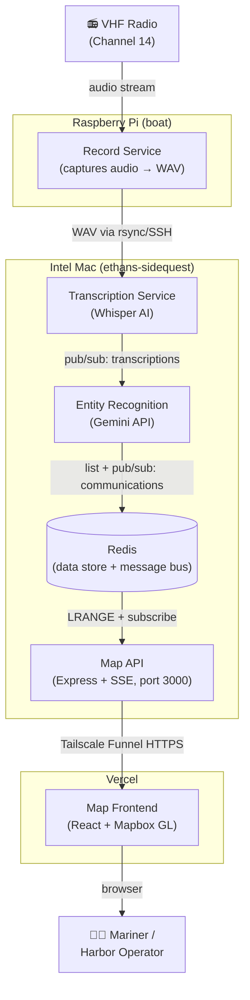

# VHF14 — Chart Ships Course (CSC)

A real-time marine radio monitor that listens to VHF Channel 14, transcribes traffic, extracts vessel information, and charts ship courses on a live map.

## Goal

**See where ships are going — in real time, on a chart, without having to listen to the radio.**

Radio → Transcript → Vessel name, course, position → Map with markers.

## Requirements

> **R1. No recordings lost.** Recordings are stored until they have been fully processed. Audio is never deleted before the transcript and extracted data are safely persisted.

> **R2. Under 5 seconds end-to-end.** From the moment a radio call is captured, the vessel's position and course must be visible on the map within 5 seconds — no manual refresh, no delay.

> **R3. Hot-plug the mic.** The microphone can be plugged in or unplugged at any time without interrupting the rest of the system. Recording resumes automatically when the mic is reconnected.

## Business Case

Mariners and harbor operators need to track vessel movements in their area without the cognitive overhead of continuously monitoring a radio. VHF Channel 14 carries routine vessel traffic including position reports, course intentions, and safety calls. Today, that information is ephemeral — heard once and gone.

VHF14 captures that radio traffic and turns it into a persistent, visual picture of vessel activity. A mariner can glance at the map and immediately see where ships are going, what they've reported, and whether any safety traffic has been broadcast — without missing anything that came through while they were busy.

## System Architecture

VHF14 runs distributed across three nodes. See [docs/ARCHITECTURE.md](docs/ARCHITECTURE.md) for full details.



## Data Flow

1. **Record** — audio is captured from the radio's audio output in 30-second WAV chunks on the Pi and rsynced to the Mac's `shared/recordings/`
2. **Transcribe** — Whisper detects new files and converts speech to text; raw transcripts are published to the Redis `transcriptions` channel
3. **Extract** — Gemini reads each transcript and pulls out: vessel name, callsign, VHF channel, message type, position, and a plain-English summary
4. **Store** — structured records are kept in the Redis `communications` list (last 100 retained)
5. **Visualize** — the map API streams new records to the browser via SSE; vessels with known positions appear as color-coded markers

## Message Types

| Color | Type | Description |
|-------|------|-------------|
| 🔴 Red | Distress | MAYDAY or emergency calls |
| 🟠 Orange | Safety | SECURITE navigational hazard announcements |
| 🔵 Blue | Traffic | Vessel traffic, schedules, berth requests |
| 🟢 Green | Routine | General communications |

## Services

| Service | Technology | Node | Role |
|---------|-----------|------|------|
| `recorder` | Python / sounddevice | Raspberry Pi | Captures microphone audio → WAV |
| `transcriber` | Python / Whisper | Intel Mac | Speech-to-text |
| `extractor` | Python / Gemini API | Intel Mac | Named entity + intent extraction |
| `api` | Express + ioredis | Intel Mac | REST + SSE API for the frontend |
| `redis` | Redis 7 | Intel Mac | Message bus + data store |
| `frontend` | React + Mapbox GL | Vercel | Web visualization (static SPA) |

## Quick Start

### Mac (transcriber + extractor + redis + api)

```bash
# 1. Configure environment
cp .env.example .env   # or create .env manually
# Set GEMINI_API_KEY and WHISPER_MODEL

# 2. Start all Mac services
make up

# 3. Expose API via Tailscale Funnel
tailscale funnel --bg 3000
# Note the Funnel URL (e.g. https://ethans-sidequest.tail-xxxxx.ts.net)
```

### Vercel (map frontend)

```bash
# Deploy from the repo root (vercel.json handles the monorepo)
vercel deploy

# Set environment variables in the Vercel dashboard:
#   VITE_MAPBOX_TOKEN = your Mapbox public token
#   VITE_API_URL      = your Tailscale Funnel URL
```

### Raspberry Pi (recorder)

```bash
# First-time setup: SSH key auth to the Mac
ssh-keygen -t ed25519 && ssh-copy-id ez@ethans-sidequest

# Install dependencies
pip install sounddevice soundfile numpy

# List audio devices
python recorder.py --list-devices

# Start recording and uploading to the Mac
python recorder.py --device 0 --remote ez@ethans-sidequest:/path/to/vhf14/shared/recordings/ --cleanup
```

### Local development (all-in-one)

```bash
# Start backend (redis + transcriber + extractor + api)
make up

# Start frontend dev server (proxies /api to localhost:3000)
cd services/map && npm install && npm run dev
```

Open [http://localhost:5173](http://localhost:5173) for the dev server, or [http://localhost:3000](http://localhost:3000) to hit the API directly.
