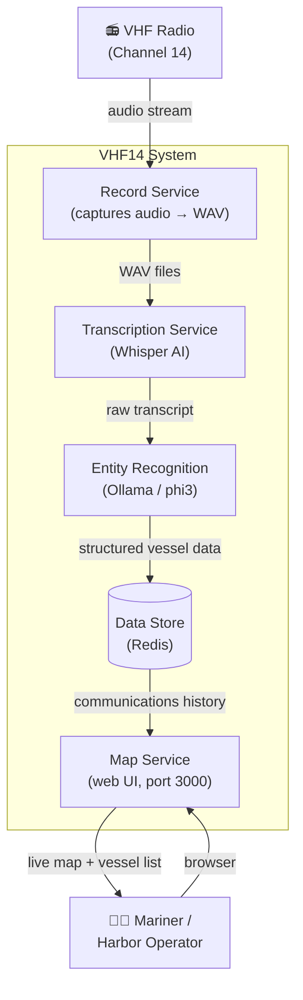

# VHF14 — Chart Ships Course (CSC)

A real-time marine radio monitor that listens to VHF Channel 14, transcribes traffic, extracts vessel information, and charts ship courses on a live map.

## Goal

**See where ships are going — in real time, on a chart, without having to listen to the radio.**

Radio → Transcript → Vessel name, course, position → Map with markers.

## Requirements

> **R1. No recordings lost.** Recordings are stored until they have been fully processed. Audio is never deleted before the transcript and extracted data are safely persisted.

> **R2. Under 5 seconds end-to-end.** From the moment a radio call is captured, the vessel's position and course must be visible on the map within 5 seconds — no manual refresh, no delay.

> **R3. Hot-plug the mic.** The microphone can be plugged in or unplugged at any time without interrupting the rest of the system. Recording resumes automatically when the mic is reconnected.

## Business Case

Mariners and harbor operators need to track vessel movements in their area without the cognitive overhead of continuously monitoring a radio. VHF Channel 14 carries routine vessel traffic including position reports, course intentions, and safety calls. Today, that information is ephemeral — heard once and gone.

VHF14 captures that radio traffic and turns it into a persistent, visual picture of vessel activity. A mariner can glance at the map and immediately see where ships are going, what they've reported, and whether any safety traffic has been broadcast — without missing anything that came through while they were busy.

## Level-1 Context Diagram



## Data Flow

1. **Record** — audio is captured from the radio's audio output in 30-second WAV chunks and written to `shared/recordings/`
2. **Transcribe** — Whisper detects new files and converts speech to text; raw transcripts are published to the message bus
3. **Extract** — an LLM (phi3 via Ollama) reads each transcript and pulls out: vessel name, callsign, VHF channel, message type, position, and a plain-English summary
4. **Store** — structured records are kept in the data store (last 100 communications retained)
5. **Visualize** — the map service streams new records to the browser via SSE; vessels with known positions appear as color-coded markers

## Message Types

| Color | Type | Description |
|-------|------|-------------|
| 🔴 Red | Distress | MAYDAY or emergency calls |
| 🟠 Orange | Safety | SECURITE navigational hazard announcements |
| 🔵 Blue | Traffic | Vessel traffic, schedules, berth requests |
| 🟢 Green | Routine | General communications |

## Services

| Service | Technology | Role |
|---------|-----------|------|
| `recorder` | Python / sounddevice | Captures microphone audio → WAV |
| `transcriber` | Python / Whisper | Speech-to-text |
| `extractor` | Python / Ollama (phi3) | Named entity + intent extraction |
| `map` | React + Mapbox GL / Express | Web visualization |
| `redis` | Redis 7 | Message bus + data store |
| `ollama` | Ollama | Local LLM inference |

## Quick Start

```bash
# 1. Add your Mapbox token
echo "MAPBOX_TOKEN=pk.your_token_here" > .env

# 2. Start all Docker services
make up

# 3. Pull the LLM model (first run only)
make pull-model

# 4. Start recording (runs locally against your audio device)
cd services/recorder
pip install -r requirements.txt
python recorder.py --list-devices      # find your radio input
python recorder.py --device 2          # start recording
```

Open [http://localhost:3000](http://localhost:3000) to view the map.
