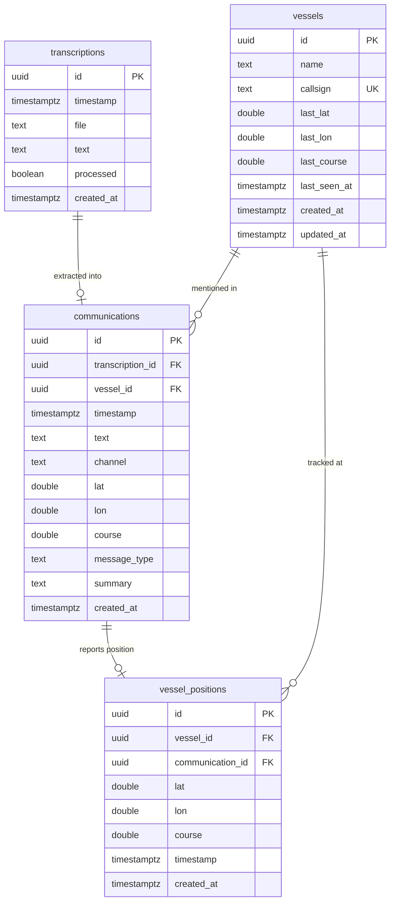

# VHF14 Entity-Relationship Diagram

Proposed Supabase PostgreSQL schema for persistent relational storage.

## ER Diagram

## Relationships

### transcriptions -> communications (1-to-0..1)

Each transcription is optionally extracted into one communication. The `processed` flag on transcriptions tracks whether the extractor has consumed the row. A transcription may not produce a communication if the audio was empty or unintelligible.

### vessels -> communications (1-to-many)

A vessel accumulates communications over time. Communications without an identifiable vessel have `vessel_id = NULL`. Vessels are matched primarily by `callsign` (unique constraint) and secondarily by `name`.

### vessels -> vessel_positions (1-to-many)

Each time a communication reports lat/lon for a vessel, a position record is created. This enables track-line rendering on the map and historical position replay.

### communications -> vessel_positions (1-to-0..1)

A communication that mentions a position creates one `vessel_positions` entry. Communications without position data do not create a position record.

## Table Details

### transcriptions

Raw Whisper output. The transcriber service INSERTs one row per WAV file. The extractor polls for rows where `processed = FALSE`.

| Column | Type | Constraints | Notes |
|--------|------|-------------|-------|
| id | UUID | PK, auto-generated | |
| timestamp | TIMESTAMPTZ | NOT NULL | When the audio was recorded |
| file | TEXT | NOT NULL | WAV filename (e.g. `recording_20260325_141500.wav`) |
| text | TEXT | NOT NULL | Full transcription text |
| processed | BOOLEAN | DEFAULT FALSE | Set to TRUE after extractor consumes the row |
| created_at | TIMESTAMPTZ | DEFAULT now() | |

**Index:** Partial index on `created_at WHERE processed = FALSE` for efficient polling.

### vessels

Unique vessel entities accumulated over time. Upserted by the extractor when a callsign or vessel name is identified.

| Column | Type | Constraints | Notes |
|--------|------|-------------|-------|
| id | UUID | PK, auto-generated | |
| name | TEXT | | Vessel name (may be NULL) |
| callsign | TEXT | UNIQUE | Radio callsign (e.g. `WDG4321`) |
| last_lat | DOUBLE PRECISION | | Most recent latitude |
| last_lon | DOUBLE PRECISION | | Most recent longitude |
| last_course | DOUBLE PRECISION | | Most recent heading (degrees) |
| last_seen_at | TIMESTAMPTZ | | Timestamp of most recent communication |
| created_at | TIMESTAMPTZ | DEFAULT now() | |
| updated_at | TIMESTAMPTZ | DEFAULT now() | Updated on each upsert |

### communications

Structured extractions from transcriptions. The extractor INSERTs one row per processed transcription. Supabase Realtime is enabled on this table to drive the frontend live feed.

| Column | Type | Constraints | Notes |
|--------|------|-------------|-------|
| id | UUID | PK, auto-generated | |
| transcription_id | UUID | FK -> transcriptions | Source transcription |
| vessel_id | UUID | FK -> vessels, nullable | Identified vessel (NULL if unknown) |
| timestamp | TIMESTAMPTZ | NOT NULL | Communication time |
| text | TEXT | NOT NULL | Raw transcription text |
| channel | TEXT | | VHF channel (e.g. `16`, `22A`) |
| lat | DOUBLE PRECISION | | Decimal latitude if mentioned |
| lon | DOUBLE PRECISION | | Decimal longitude if mentioned |
| course | DOUBLE PRECISION | | Heading in degrees if mentioned |
| message_type | TEXT | NOT NULL, CHECK constraint | One of: `routine`, `safety`, `distress`, `traffic` |
| summary | TEXT | NOT NULL | One-sentence plain-English summary |
| created_at | TIMESTAMPTZ | DEFAULT now() | |

**Indexes:** `timestamp DESC` for feed ordering, `vessel_id` for vessel-specific queries.

### vessel_positions

Position history for track-line rendering. One record per communication that reports a position.

| Column | Type | Constraints | Notes |
|--------|------|-------------|-------|
| id | UUID | PK, auto-generated | |
| vessel_id | UUID | FK -> vessels, NOT NULL | Which vessel |
| communication_id | UUID | FK -> communications | Source communication |
| lat | DOUBLE PRECISION | NOT NULL | Decimal latitude |
| lon | DOUBLE PRECISION | NOT NULL | Decimal longitude |
| course | DOUBLE PRECISION | | Heading in degrees |
| timestamp | TIMESTAMPTZ | NOT NULL | When the position was reported |
| created_at | TIMESTAMPTZ | DEFAULT now() | |

**Index:** Composite `(vessel_id, timestamp DESC)` for efficient track queries.

## Row-Level Security

| Table | anon | service_role |
|-------|------|-------------|
| transcriptions | No access | INSERT, UPDATE |
| vessels | SELECT | INSERT, UPDATE |
| communications | SELECT | INSERT |
| vessel_positions | SELECT | INSERT |

## Supabase Realtime

Enabled on:
- **communications** -- drives the live communication feed in the frontend
- **vessels** -- drives live vessel entity updates (last position, last seen)
